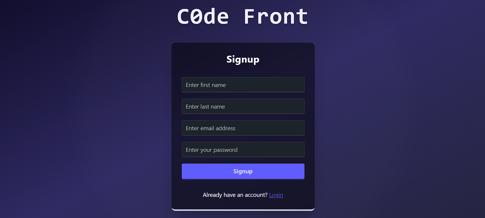
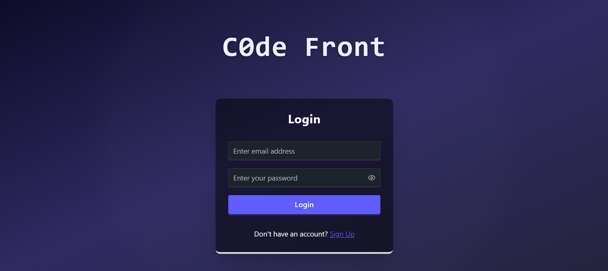
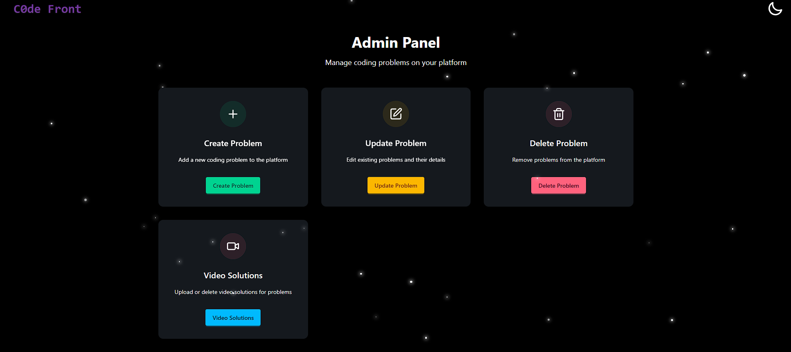

# 🚀 C0de Front

## 📚 Table of Contents

1. [Introduction](#1-introduction)
2. [Problem Statement](#2-problem-statement)
3. [Features](#3-features)
4. [Requirements & Setup](#4-requirements--setup)
5. [Mongoose Schema Definitions for C0de Front](#5-mongoose-schema-definitions-for-c0de-front)
6. [High Level Architecture](#6-high-level-architecture)
7. [Backend Flow](#7-backend-flow)
8. [FrontEnd](#8-frontend)
9. [Conclusion](#9-conclusion)

---


# 1. Introduction

**C0de Front** is a LeetCode-style coding platform developed to help users practice DSA problems with a robust full-stack experience. It features:

- A backend for problem management, user authentication, and live code execution.
- A frontend with:
  - A built-in code editor (Monaco)
  - Chat-based AI assistant (Gemini API)
  - Upcoming Cloudinary video upload integration

---

# 2. Problem Statement

The goal was to build a coding platform similar to LeetCode where users can:

- Solve coding problems online
- Track their progress and submissions
- Get real-time help via an AI assistant
- Upload video solutions and explanations

**Key challenges included:**

- Building a secure and scalable backend
- Efficient schema design for DSA problems and user data
- Code execution sandbox integration
- Responsive and interactive frontend
- AI and multimedia integration

---

---
# 3. Features

### 🔐 Authentication & Authorization
- Secure **user authentication** using **JWT** tokens and **bcrypt** password hashing.
- **Role-based access control** (`admin`, `user`) implemented via custom middleware.
- **Token blacklisting** using **Redis** ensures secure logout and session handling.

### 👤 User Functionality
- **Signup/Login** system with JWT authentication.
- Users can:
  - **View all coding problems** or filter only their **solved problems**.
  - **Run** or **Submit** code for any problem in **Java, C++, or JavaScript**.
  - **Delete their profile**, which also removes all related submissions.

### 🧑‍💼 Admin Functionality
- Full problem management capabilities:
  - **Create**, **update**, and **delete** coding problems.
  - Add **problem metadata**: title, description, difficulty level (`easy`, `medium`, `hard`), and topic tags (`array`, `graph`, etc.).
  - Add both **visible and hidden test cases**.
  - Provide **boilerplate code** and **reference solutions** for each supported language.

### 🧪 Code Execution & Evaluation
- **Judge0 API integration** to compile and run user code.
- **Run mode**: Executes code without saving submission.
- **Submit mode**: Executes code against all test cases and saves the result in the database.
- All user code input is **sanitized** to avoid execution errors.

### 🧠 AI-Powered Chatbot (via Gemini API)
- Integrated an **AI assistant** to help users with **DSA-related doubts**.
- Enhancements for contextual and safe interactions:
  - **Max output token limit** of 500 to manage resource usage.
  - **System Instructions** restrict responses strictly to coding/problem-solving topics.
  - Automatically passes the **current problem’s title, description, test cases, and boilerplate** as context.
  - Enables users to ask vague queries like _“help me with this problem”_ and receive accurate, relevant help.
 
### 📹 Video Integration (Cloudinary)
- Secured video uploads with API signature authentication, handling form data (signature, timestamp, public ID, API key).
- Saved and managed video metadata (problem ID, user ID, Cloudinary public ID, secure URL, duration, thumbnail) in MongoDB with duplicate checks.
- Integrated uploaded videos into problem editorials, displaying metadata (thumbnails, durations) for enhanced user learning.
- Designed deletion workflow to remove videos from Cloudinary and MongoDB with user authentication and error handling.

### 🗃️ Database Design
- **Three core Mongoose schemas**:
  - `User`: Includes role, problem history, and secure fields.
  - `Problem`: Fully structured problem model with test cases, tags, and more.
  - `Submission`: Stores every code submission, its result, runtime, and metadata.
- **Compound indexing** on `(userId, problemId)` in the `Submission` schema for efficient querying.

### 🔮 Future Enhancements
- **Video solution support** via **video streaming integration** is planned in the next phase.
  
---


# 4. Requirements & Setup

Make sure you have **Node.js**, **npm**, and **MongoDB** installed.

Then, install the following packages:

## 📦 Backend Dependencies

Install the following packages to set up the backend server.

### Tech Stack: Node.js, Express.js, MongoDB, Mongoose, Cookie-Parser, Dotenv, JSON Web Token, Validator, Redis, Axios, Bcrypt, CORS
```
npm install express mongoose cookie-parser dotenv jsonwebtoken validator redis axios bcrypt cors
```

## 💻 Frontend Dependencies

Install these packages to set up the frontend using React and Tailwind CSS.

### Tech Stack: React, Redux, JSX, Tailwind CSS, DaisyUI, Vite, react-hook-form, Zod, @hookform/resolvers, @monaco-editor/react, @google/genai, react-markdown, remark-gfm, rehype-highlight
```
npm install react redux tailwindcss daisyui vite react-hook-form zod @hookform/resolvers @monaco-editor/react @google/genai react-markdown remark-gfm rehype-highlight
```

---


# 5. Mongoose Schema Definitions for C0de Front

This  outlines the MongoDB (Mongoose) schema definitions used in the **C0de Front** application.


## 🧑 User Schema

### Fields
```js
firstName:        { type: String, required: true, minLength: 2, maxLength: 20 },
lastName:         { type: String, minLength: 3, maxLength: 20 },
emailID:          { type: String, required: true, unique: true, trim: true, lowercase: true, immutable: true },
age:              { type: Number, min: 5, max: 80 },
role:             { type: String, enum: ['user', 'admin'], default: 'user' },
problemSolved:    [{ type: Schema.Types.ObjectId, ref: 'problem' }],
password:         { type: String, required: true }
```

### Options
```js
{ timestamps: true }
```

### Post Hook
```js
userSchema.post('findOneAndDelete', async function (userInfo) {
  if (userInfo) {
    await mongoose.model('submission').deleteMany({ userId: userInfo._id });
  }
});
```


## 📤 Submission Schema

### Fields
```js
userId:           { type: Schema.Types.ObjectId, ref: 'user', required: true, index: true },
problemId:        { type: Schema.Types.ObjectId, ref: 'problem', required: true, index: true },
code:             { type: String, required: true },
language:         { type: String, required: true, enum: ['javascript', 'c++', 'java'] },
status:           { type: String, enum: ['pending', 'accepted', 'wrong answer', 'time limit exceeded', 'compilation error', 'runtime error', 'error'], default: 'pending' },
runtime:          { type: Number, default: 0 },   // in milliseconds
memory:           { type: Number, default: 0 },   // in KB
errorMessage:     { type: String, default: '' },
testCasesPassed:  { type: Number, default: 0 },
testCasesTotal:   { type: Number, default: 0 }
```

### Options
```js
{ timestamps: true }
```

### Compound Indexing
```js
submissionSchema.index({ userId: 1, problemId: 1 });
```


## 📚 Problem Schema

### Fields
```js
title:            { type: String, required: true },
description:      { type: String, required: true },
difficulty:       { type: String, enum: ['easy', 'medium', 'hard'], required: true },
tags:             { type: String, enum: ['array', 'linkedList', 'graph', 'dp'], required: true },
visibleTestCases: [{
  input:          { type: String, required: true },
  output:         { type: String, required: true },
  explanation:    { type: String, required: true }
}],
hiddenTestCases: [{
  input:          { type: String, required: true },
  output:         { type: String, required: true }
}],
startCode: [{
  language:       { type: String, required: true },
  initialCode:    { type: String, required: true }
}],
referenceSolution: [{
  language:       { type: String, required: true },
  completeCode:   { type: String, required: true }
}],
problemCreator:    { type: Schema.Types.ObjectId, ref: 'user', required: true }
```

### Options
```js
{ timestamps: true }
```

## 🎥 VideoSolution Schema

### Fields
```js
problemId:         { type: Schema.Types.ObjectId, ref: 'problem', required: true },
userId:            { type: Schema.Types.ObjectId, ref: 'user', required: true },
cloudinaryPublicId:{ type: String, required: true, unique: true },
secureUrl:         { type: String, required: true },
thumbnailUrl:      { type: String },
duration:          { type: Number, required: true }
```

### Options
```js
{ timestamps: true }
```

---

# 6. High Level Architecture

##  Overview

- **Full-Stack Platform**:  
  C0de Front is designed as a full-stack coding platform focused on DSA (Data Structures and Algorithms) practice.

- **Frontend (React)**:
  - Built using **React** with **Monaco Editor** for code input.
  - **Redux** is used for global state management.
  - UI styled using **Tailwind CSS** and **DaisyUI**.
  - Communicates with the backend through **HTTP/REST APIs**.

- **Backend (Node.js/Express)**:
  - Handles all business logic, route handling, and integration with third-party services.
  - Protected with **JWT-based authentication middleware** and **rate limiters**.

- **Database (MongoDB)**:
  - Stores data using four core schemas:
    - `User`
    - `Problem`
    - `Submission`
    - `VideoSolution` *(upcoming)*
  - Efficient querying via **indexing** (e.g., compound index on `userId` + `problemId`).

- **Third-Party Integrations**:
  - 🧠 **Gemini API**: Provides AI chatbot support for DSA-related queries.
  - 🧪 **Judge0 API**: Compiles and executes submitted code against visible and hidden test cases.
  - 📹 **Cloudinary** *(in progress)*: Will store video solutions submitted by users.

- **Security & Middleware**:
  - **JWT authentication** ensures protected routes.
  - **Rate limiting** helps prevent abuse (especially for code submission).

- **Deployment**:
  - Currently running **locally**:
    - Backend on a local Node.js server.
    - Frontend hosting planned (e.g., **Netlify**, **Vercel**, etc.).
  - Assumes a **stable internet connection** for external API calls.
  - Not yet optimized for high traffic (acknowledged area of growth).

- **Vision**:
  - Provide users with the ability to:
    - Practice coding problems.
    - Track their progress.
    - Receive AI-based help.
    - Access future features like **video streaming** for solutions.

  

---

# 7. Backend Flow
### Working of Authorization


### Working of Problem Creation/Updation/Deletion/Viewing


### Working of Submission

### Working of AI Chatbot


### Working of Video Upload/ Delete


---

# 8. FrontEnd

As someone opens the site he/she is redirected to signup page, if not authorized. The user can choose to either signup or login.

<p align="center">
  
  
</p>

---

After signup/login user lands on homepage. The Explore Problem leads to Problem Page.
<p align="center">
  
  
</p>

On Problem Page user can see the problems, his/her progress, filter such as Diffculty, Topic, All/Solved problems to filter questions.
Left image shows homepage in dark mode, right image shows homepage with filters applied (tag: Graph, difficulty: medium)

<p align="center">
  
  
</p>

---

If the user is an admin he/she can Create/Update/Delete problems



Admin can create a problem by filling details of 'title', 'description', 'difficulty', 'problem tag', 'visible test-cases', 'hidden test-cases', 'bolierplate code and reference solution for C++, Java & Javascript'.

<p align="center">
  
  
</p>

---

Admin can update a particular problem.


Admin can update a problem or it's details. The details will be fetched from database via backend which admin can update.


---

Admin can delete a particular problem.


---

Admin can uplod/delete video for any problem.


---

Apart from this any user (normal or admin) can attempt any question. After clicking on any question from homepage, user will be directed to problem page.
The page contains Description, Editorial, Submissions, Solutions, AI Chatbot on left panel and Code editor on Right Panel. 

Description section:

<p align="center">


</p>

---

Editorial TV section:


---

Solutions section:


---

Submissions section:

<p align="center">


</p>

---

AI Chatbot section (the bold text and code are formatted using ReactMarkDown):


---

After submitting the code:


---

User Profile section:

<p align="center">


</p>

---

# 9. Conclusion

C0de Front is a feature-rich, scalable, and extensible LeetCode-style coding platform designed from the ground up with real-world software engineering practices. By integrating AI support, Video Upload feature, secure authentication, live code execution, and multimedia editorial features, the platform offers an end-to-end experience for both learners and administrators.

This project not only demonstrates technical depth across the MERN stack and integration with external APIs (Judge0, Gemini, Cloudinary), but also showcases strong skills in system design, security, performance optimization, and developer tooling.

While future enhancements such as video streaming, Docker-based containerization, or CI/CD pipelines can take the project to the next level, C0de Front already represents a mature, production-ready system that reflects industry-grade engineering practices.

---

THIS WRAPS UP IT ALL. Currently deployed on AWS.
